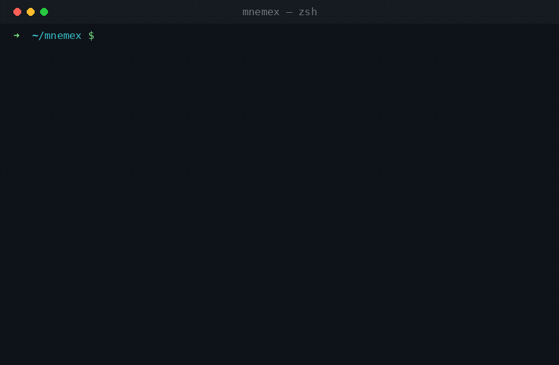

<div align="center">

# 🧠 mnemex

**Your second brain, curated by an LLM. Books in, structured wiki out.**

[](LICENSE)
[](https://nodejs.org)
[](https://modelcontextprotocol.io)

<br>



</div>

---

`mnemex` is a personal knowledge system. You tell an LLM *"ingest this book"*,
and it reads the whole thing and files it into a structured, cross-linked wiki of:

- **Sources** — books, articles, papers (metadata + chapter summaries + extracted claims)
- **Entities** — the people, companies, and tools mentioned
- **Concepts** — ideas and frameworks, each with `When to use` / `When NOT to use`, cross-links, and a source count
- **Syntheses** — multi-source theories *you* derive ("how do these five books on negotiation actually fit together?")

Everything is plain Markdown, version-controlled, locally hosted, and LLM-readable.
It's the opposite of RAG: instead of re-discovering knowledge on every query,
the wiki **compiles knowledge once and keeps it current**. Every ingest makes it
richer.

> Inspired by [Karpathy's LLM Wiki idea](https://gist.github.com/karpathy/442a6bf555914893e9891c11519de94f) — made real and turnkey.

---

## Quick start (≈5 minutes)

```bash
curl -fsSL https://raw.githubusercontent.com/Daniil-Sokolskiy/mnemex/main/install.sh | bash
```

This installs the MCP servers + CLI, scaffolds a wiki at `~/mnemex`, and prints
setup instructions for your client — **Claude Desktop** (paste a config block) or
**Claude Code** (run two `claude mcp add` commands). These are local servers, so
the web app (claude.ai) can't use them directly. Wire up your client, then say:

> **"help me ingest my first book — Meditations by Marcus Aurelius"**

Watch `index.md` grow as the agent reads the book and files it.

<details>
<summary>Manual install</summary>

```bash
npm install -g @mnemex/library-mcp @mnemex/cli
npx playwright install chromium          # for Anna's Archive search
mnemex init ~/mnemex                  # scaffold the wiki
mnemex doctor                           # verify deps
mnemex mcp install --wiki ~/mnemex    # print setup for Desktop + Claude Code
```

`mnemex mcp install` prints copy-paste setup for both Claude Desktop and Claude
Code and never edits any config file silently.

</details>

---

## What's in the box

| Package | What it is |
|---|---|
| [`@mnemex/library-mcp`](packages/library-mcp) | MCP server to search + download books from Project Gutenberg and Anna's Archive into your wiki. Includes a **Playwright-based Anna's search** that works against their current client-side-rendered pages (plain HTTP scraping no longer returns results). |
| [`@mnemex/cli`](packages/cli) | `mnemex init` / `doctor` / `mcp install` — scaffold a wiki and wire up the servers. |
| [`apps/wiki-template`](apps/wiki-template) | The starter wiki: `CLAUDE.md` operating manual, page templates, ingest scripts, empty structure. |
| **search** via [`qmd`](https://www.npmjs.com/package/@tobilu/qmd) | mnemex wires up `qmd` (local BM25 + vector engine) as the `mnemex-search` MCP server over your wiki. `mnemex setup-search` installs + indexes it; the agent then has `brain.query` for hybrid retrieval. |

### Downloading from Anna's: free vs paid

Search always works and needs no account. **Downloading** has two paths:

| | How | Needs |
|---|---|---|
| **Free** | The search result includes a `download_page_url`. Open it in your browser and use Anna's free "slow download" (a short wait timer, sometimes a check). | nothing |
| **Automated** | `library_annas_download` fetches the file directly into your wiki, no browser. | a paid Anna's membership — set `ANNAS_ARCHIVE_KEY` (your account's *secret key*) |

The automated path uses Anna's `fast_download` API, which **requires a membership key** — that's Anna's restriction, not mnemex's. Free downloads exist but go through the browser slow-download page (mnemex can't fully automate that: there's a wait timer and occasionally a check, and bypassing checks is out of scope). So without a key you still get every search result plus a one-click link to grab the file for free.

Project Gutenberg downloads are always free and fully automated — no key, no browser.

---

## How it works

```
  you: "ingest Atomic Habits"
        │
        ▼
  library-mcp ──► search Gutenberg + Anna's ──► download ──► raw/books/<slug>/book.md
        │
        ▼
  the LLM agent reads CLAUDE.md, then the book, then:
        ├─ writes wiki/sources/Atomic-Habits-Clear-2018.md
        ├─ creates/updates wiki/entities/  (James-Clear, etc.)
        ├─ creates/updates wiki/concepts/  (Habit-Loop, Identity-Based-Habits, …)
        ├─ updates index.md  (counts + catalog)
        └─ appends log.md
```

The `CLAUDE.md` in your wiki root is the agent's operating manual — naming
conventions, frontmatter schema, the ingest/query/lint workflows, and the
relationship vocabulary (`Builds on` / `Subsumes` / `Contrasted with` …).

## Methodology

The wiki structure is opinionated. The patterns that make it scale:

- **[Two-phase ingest](docs/methodology/two-phase-ingest.md)** — split content writing (sub-agent) from bookkeeping (parent) to avoid timeouts on big books.
- **[Cluster ingest](docs/methodology/cluster-pattern.md)** — ingest 5 themed books together with cross-link "sibling hooks" so concepts mature fast.
- **[Status lifecycle](docs/methodology/status-lifecycle.md)** — `stub` → `draft` → `mature` (3+ sources, reviewed).

## Requirements

- Node.js ≥ 20
- `pandoc` (epub/pdf → markdown)
- Chromium via Playwright (for Anna's search)
- An MCP-capable LLM client (Claude Desktop, Claude Code, Cowork, …)

## ⚠️ Legal

`library-mcp` includes a client for Anna's Archive, which is subject to ongoing
legal action. This project hosts and distributes nothing; you are responsible
for compliance with copyright law in your jurisdiction. See
[docs/annas-disclaimer.md](docs/annas-disclaimer.md). For a fully
copyright-clean workflow, use only the Project Gutenberg tools (~70,000
public-domain texts).

## Contributing

PRs welcome — see [docs/contributing.md](docs/contributing.md). The Anna's DOM
parser in `packages/library-mcp/src/annas.ts` needs occasional updates when
Anna's changes its markup; that's the most common maintenance task.

## License

[MIT](LICENSE)
